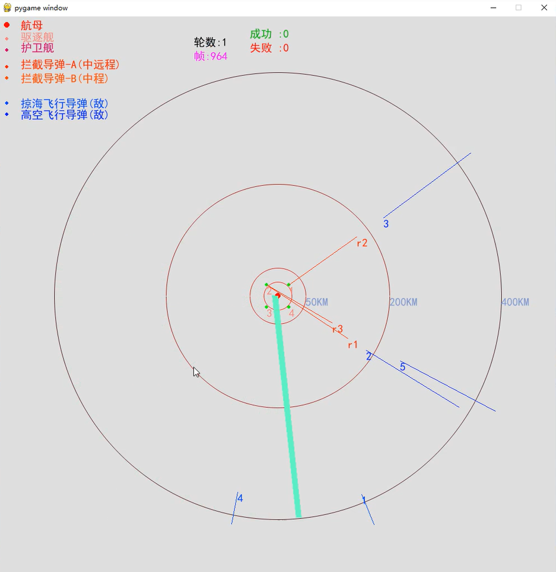
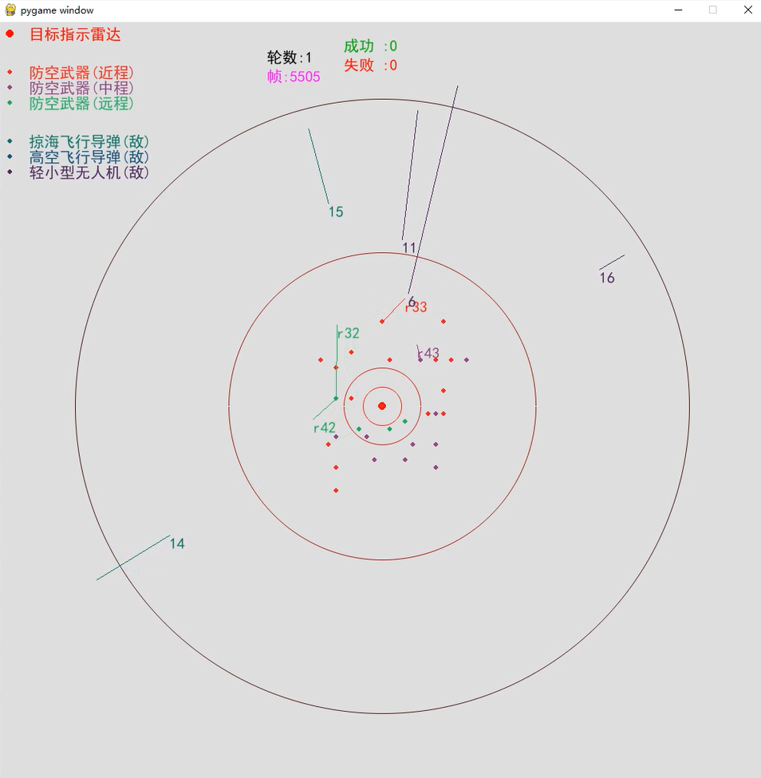

# Description
防空反导 (Air Defense and Missile Defense)，一种基于Pygame, Gym的强化学习环境. 可用于训练多智能体火力单元分配策略的学习。\
本仓库仅包含仿真环境代码，具体算法需要读者自己设计。运行效果见`demo`目录。


# Dependencies
```sh
pip install pygame==2.1.0  gym==0.25.0
```

# Demo
详见 `demo` 目录

<table rules="none" align="center">
	<tr>
		<td>
			<center>
				 <br/>
				<font color="AAAAAA"> demo1</font>
			</center>
		</td>
		<td>
			<center>
				 <br/>
				<font color="AAAAAA"> demo2</font>
			</center>
		</td>
	</tr>
</table>

